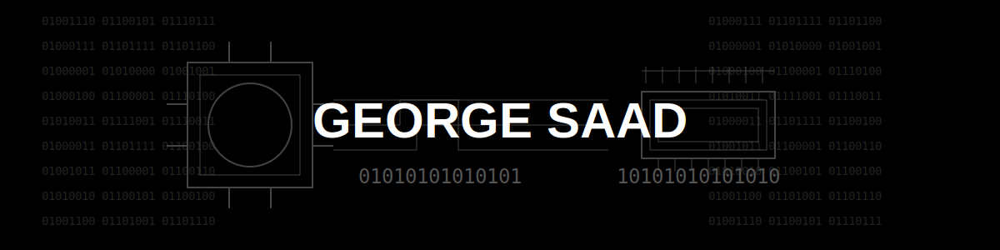

# 👋 Hi, I'm George – Backend Developer (Golang)

I’m a passionate **Golang backend engineer** with a strong focus on building **secure**, **scalable**, and **cleanly architected systems**. My work revolves around solving real-world problems using microservices, distributed systems, and security-first principles.

---

## 💼 What I Do

- 🔧 Build **RESTful APIs** and **microservices** in Go using tools like **Gin**, **GORM**, and **gRPC**
- 🔐 Design with **security in mind**, applying best practices (JWT, RBAC, input validation, rate limiting)
- 🧪 Integrate **testing and CI/CD pipelines** (GoSec, Docker, GitHub Actions)
- 🐳 Containerize and orchestrate services with **Docker Compose**
- 📈 Implement **monitoring and tracing** using **Prometheus, Grafana, and Jaeger**
- 💡 Explore cybersecurity tools and automation techniques

# 💻 Tech Stack:
           

---

<!-- Proudly created with GPRM ( https://gprm.itsvg.in ) -->
